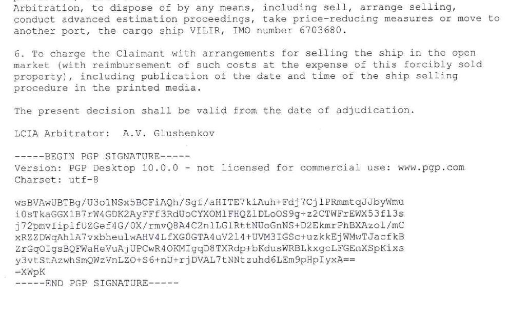

The International Arbitration and Cryptography Centre Limited is an international arbitration authority based in London, U.K. 
Cryptonomica® is the registered trade mark of The International Arbitration and Cryptography Centre Limited.

The International Arbitration and Cryptography Centre (IACC) is the first international arbitration institution that made international arbitration fully online using electronic documnets and videoconference, and the only arbitration institution that develops its Arbitration Rules on Github.

Cryptonomica was named one of the best legal Innovations of 2016 by [The Hague Institute for Innovation of Law (HiiL)](http://www.hiil.org/).

Current version of our Arbitration Rules: [Arbitration Rules, version 1.0 of 2015-12-10](Arbitration_Rules/IACC/IACC-Arbitration-Rules.EN.signed.md)

It is open source, like free software: everybody who is interested in creating next version can fork and send pull requests. Delevopment of next version - in branch 'ver-2'.

We started developing our Rule of Arbitration from text of The United Nations Commission on International Trade Law (UNCITRAL) [Arbitration Rules](http://www.uncitral.org/uncitral/en/uncitral_texts/arbitration/2010Arbitration_rules.html), witch are recommended for use "as a model for institutions drafting their own arbitration rules" by [Recommendations to assist arbitral institutions and other interested bodies with regard to arbitration under the UNCITRAL Arbitration Rules](http://www.uncitral.org/uncitral/en/uncitral_texts/arbitration/2012Recommendations.html)

As advised by UNCITRAL in [Recommendations](http://www.uncitral.org/pdf/english/texts/arbitration/arb-recommendation-2012/13-80327-Recommendations-Arbitral-Institutions-e.pdf) "If an institution uses the UNCITRAL Arbitration Rules as a model for drafting its own institutional rules, it may be useful for the
institution to consider indicating where those rules diverge from the
UNCITRAL Arbitration Rules" And we think *Git is an ideal tool to be used for this purpose*.

There are already legal projects using git (see: http://www.openlawlab.com/2014/08/05/githubbing-law/ ) and we think this is could be a trend.

We are also planning to develop on Github model contracts, clauses and other legal forms, especially for using in international trade, digitally signed documents, cryptocurrency transaction.

-----------------------------------------------------------------------------

The master branch is for final versions of the Arbitration Rules, and supporting documents.
Currently we develop [ver.2.0](https://github.com/Cryptonomica/arbitration-rules/tree/ver-2), and we started a branch for it.

----------------------------------------------------------------------------

video of real arbitration hearing held in video-conference:

-----------------------------------------------------------------------------
Arbitration Award signed with digital signature:

 

You can see our other arbitral awards: 

[Ship.img.[eng.only].pdf](awards/Ship.img.[eng.only].pdf)

[Baltic.img.[eng.only].pdf](awards/baltic.img.[eng.only].pdf)

[Real.estate.img.[eng.only].pdf](awards/real.estate.img.[eng.only].pdf)

-----------------------------------------------------------------------------

For additional information see:

[www.cryptonomica.net](http://cryptonomica.net) 

Telegram group: https://t.me/cryptonomicanet 

Reddit: https://www.reddit.com/r/cryptonomica/ 

Facebook: https://www.facebook.com/cryptonomica 

LinkedIn: https://www.linkedin.com/company/9552383/ 

-------------------------------------------------------------------------------
